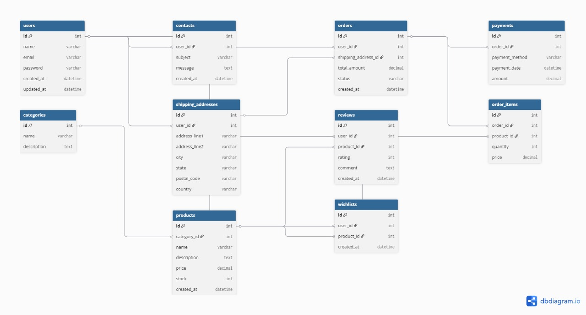

# 🗂️ Struktur Database - Aplikasi Penjualan Alat Musik

Dokumen ini menjelaskan struktur database yang digunakan dalam aplikasi, termasuk daftar tabel, relasi antar tabel, dan fungsinya.

---

## 🧱 Tabel-Tabel Utama

### 1. `users`
Menyimpan data pengguna (customer dan admin).

| Kolom       | Tipe       | Keterangan               |
|-------------|------------|--------------------------|
| id          | int        | Primary key              |
| name        | varchar    | Nama lengkap             |
| email       | varchar    | Email unik               |
| password    | varchar    | Password (hash)          |
| created_at  | datetime   | Waktu pendaftaran        |
| updated_at  | datetime   | Waktu update terakhir    |

---

### 2. `categories`
Kategori alat musik (misalnya: gitar, drum, piano).

| Kolom       | Tipe     | Keterangan             |
|-------------|----------|------------------------|
| id          | int      | Primary key            |
| name        | varchar  | Nama kategori          |
| description | text     | Deskripsi kategori     |

---

### 3. `products`
Daftar alat musik yang dijual.

| Kolom       | Tipe     | Keterangan                 |
|-------------|----------|----------------------------|
| id          | int      | Primary key                |
| category_id | int      | Foreign key → categories   |
| name        | varchar  | Nama produk                |
| description | text     | Deskripsi produk           |
| price       | decimal  | Harga                      |
| stock       | int      | Stok tersedia              |
| created_at  | datetime | Tanggal dibuat             |

---

### 4. `orders`
Data pesanan yang dibuat oleh customer.

| Kolom              | Tipe     | Keterangan                         |
|--------------------|----------|------------------------------------|
| id                 | int      | Primary key                        |
| user_id            | int      | Foreign key → users                |
| shipping_address_id| int      | Foreign key → shipping_addresses   |
| total_amount       | decimal  | Total harga                        |
| status             | varchar  | Status (menunggu, diproses, dll.) |
| created_at         | datetime | Tanggal dibuat                     |

---

### 5. `order_items`
Item produk dalam setiap pesanan.

| Kolom       | Tipe     | Keterangan                      |
|-------------|----------|---------------------------------|
| id          | int      | Primary key                     |
| order_id    | int      | Foreign key → orders            |
| product_id  | int      | Foreign key → products          |
| quantity    | int      | Jumlah dibeli                   |
| price       | decimal  | Harga per unit saat pembelian   |

---

### 6. `payments`
Data pembayaran dari customer.

| Kolom          | Tipe     | Keterangan                      |
|----------------|----------|---------------------------------|
| id             | int      | Primary key                     |
| order_id       | int      | Foreign key → orders            |
| payment_method | varchar  | Metode pembayaran               |
| payment_date   | datetime | Tanggal pembayaran              |
| amount         | decimal  | Jumlah yang dibayar             |

---

### 7. `reviews`
Ulasan produk dari customer.

| Kolom      | Tipe     | Keterangan                      |
|------------|----------|---------------------------------|
| id         | int      | Primary key                     |
| user_id    | int      | Foreign key → users             |
| product_id | int      | Foreign key → products          |
| rating     | int      | Skor (1–5)                      |
| comment    | text     | Isi review                      |
| created_at | datetime | Tanggal review                  |

---

### 8. `wishlists`
Daftar keinginan customer terhadap produk.

| Kolom      | Tipe     | Keterangan                   |
|------------|----------|------------------------------|
| id         | int      | Primary key                  |
| user_id    | int      | Foreign key → users          |
| product_id | int      | Foreign key → products       |
| created_at | datetime | Tanggal ditambahkan          |

---

### 9. `shipping_addresses`
Alamat pengiriman customer.

| Kolom         | Tipe     | Keterangan                  |
|---------------|----------|-----------------------------|
| id            | int      | Primary key                 |
| user_id       | int      | Foreign key → users         |
| address_line1 | varchar  | Alamat utama                |
| address_line2 | varchar  | Alamat tambahan (opsional)  |
| city          | varchar  | Kota                        |
| state         | varchar  | Provinsi                    |
| postal_code   | varchar  | Kode pos                    |
| country       | varchar  | Negara                      |

---

### 10. `contacts`
Pesan dari customer (hubungi kami).

| Kolom      | Tipe     | Keterangan                |
|------------|----------|---------------------------|
| id         | int      | Primary key               |
| user_id    | int      | Foreign key → users       |
| subject    | varchar  | Subjek pesan              |
| message    | text     | Isi pesan                 |
| created_at | datetime | Tanggal dikirim           |

---

## 🔗 Relasi Antar Tabel

- **users** → memiliki banyak `orders`, `reviews`, `wishlists`, `shipping_addresses`, dan `contacts`
- **orders** → memiliki banyak `order_items` dan satu `payment`
- **products** → memiliki banyak `order_items`, `reviews`, dan `wishlists`
- **categories** → memiliki banyak `products`

---

## 🧭 Diagram ERD

Lihat diagram visual:  

---

